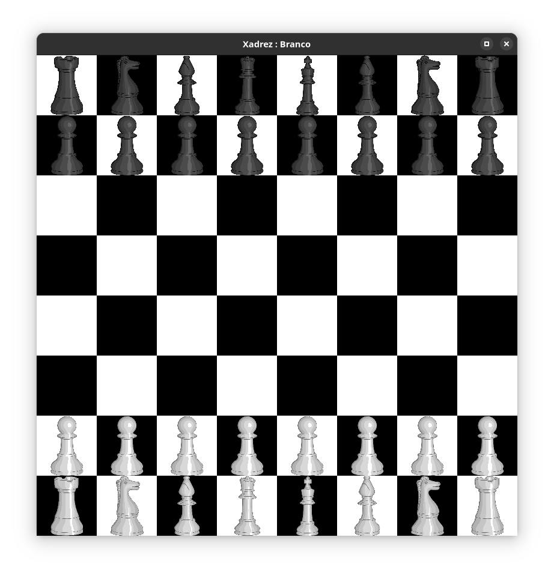
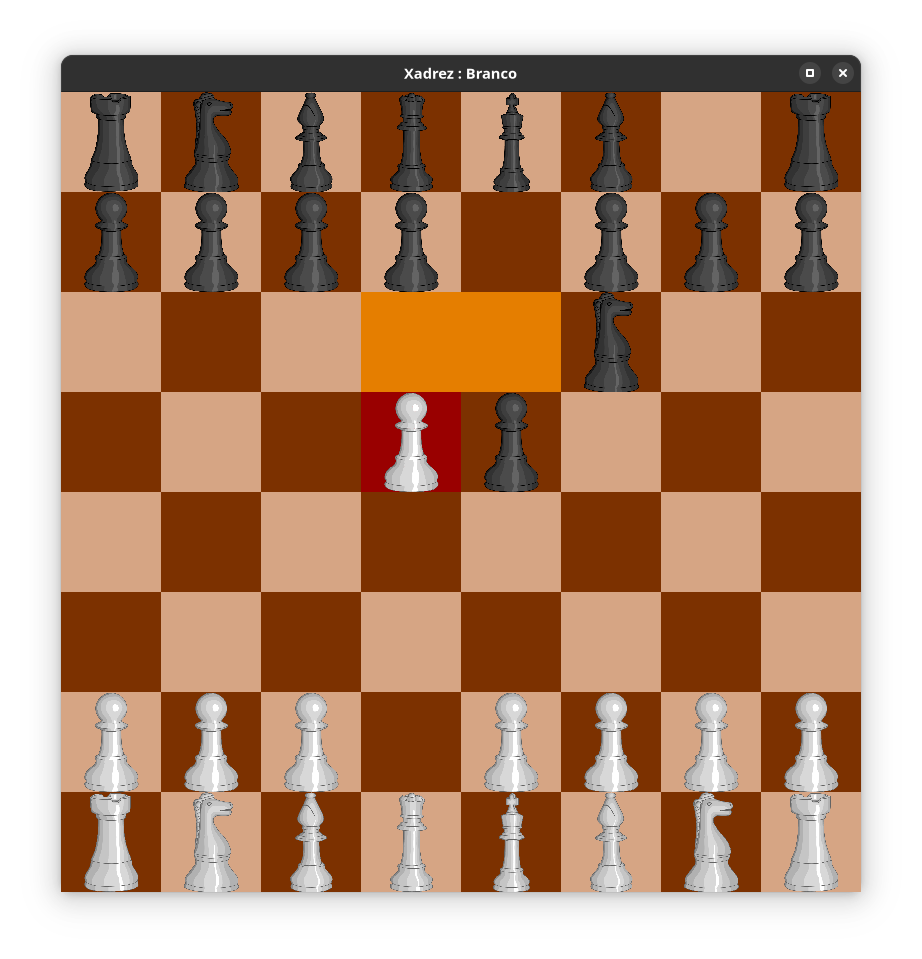

# Jogo de Tabuleiro
É simplesmente um jogo de Xadrez feito em python




Antes de iniciar o jogo
é nescessário que a pasta Recursos/Xadrez
contenha as imagens das peças
com os nomes definidos nas classes em PecasXadrez.py

Para fazer isso crie a pasta onde serão salvas as imagens:

```
mkdir Recursos/Xadrez
```

Depois rode o script para criar as imagens:
```
python3 RedefinirRecursos.py
```


Depois disso é possível iniciar o jogo com o comando:
```
python3 Jogar.pyw
```

# Funcionalidade
- Movimentação
  - Movimentos das peças
  - Movimento especiais (roque e en passant)
  - Obs: Não foi implementado o xeque mate nem o rei afogado
- Desfazer movimentos
- Pacotes: É possível mudas as cores das casas
  do tabuleiro para diferentes configurações
